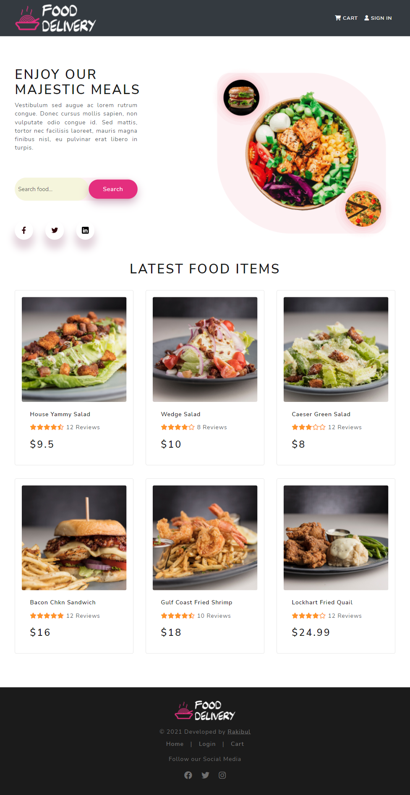
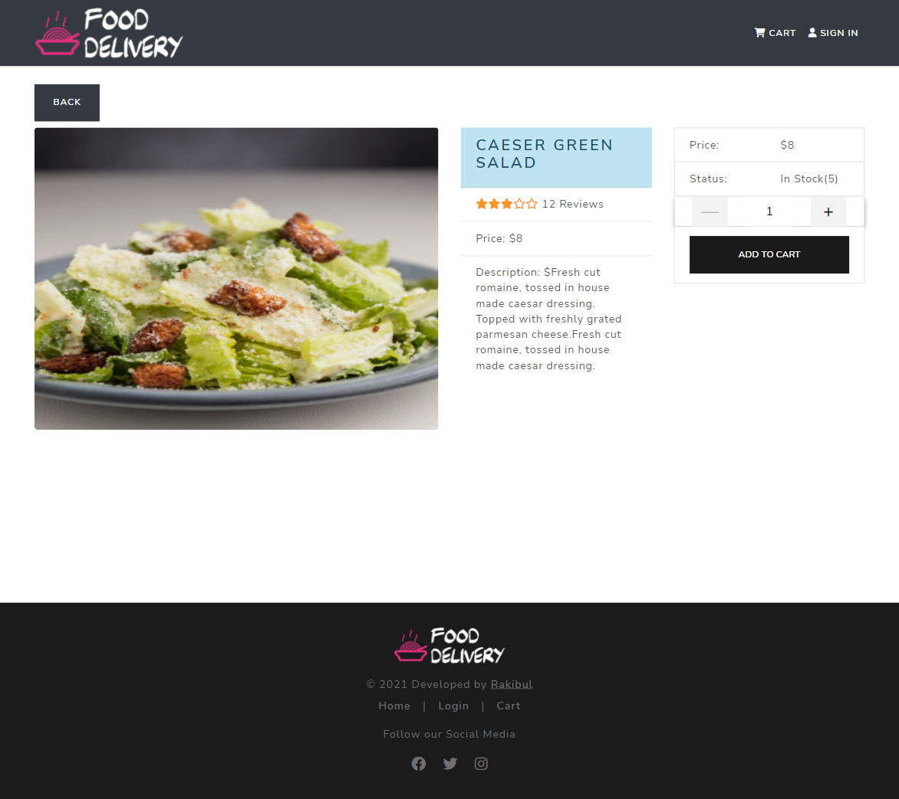
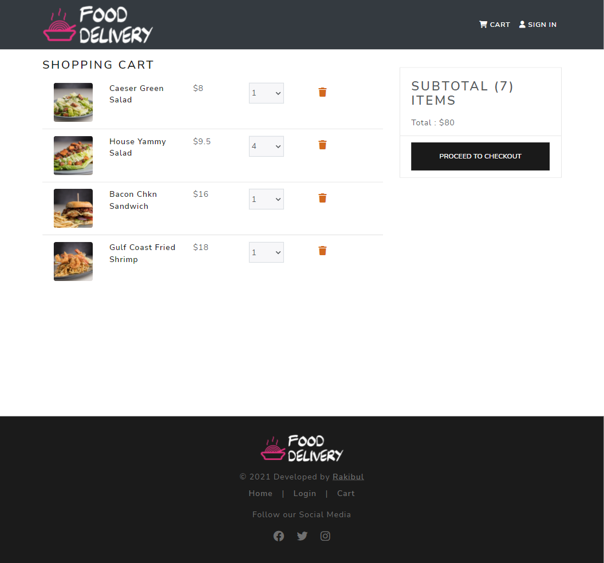
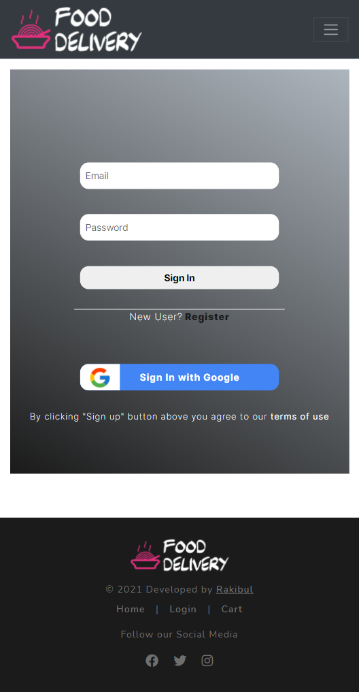
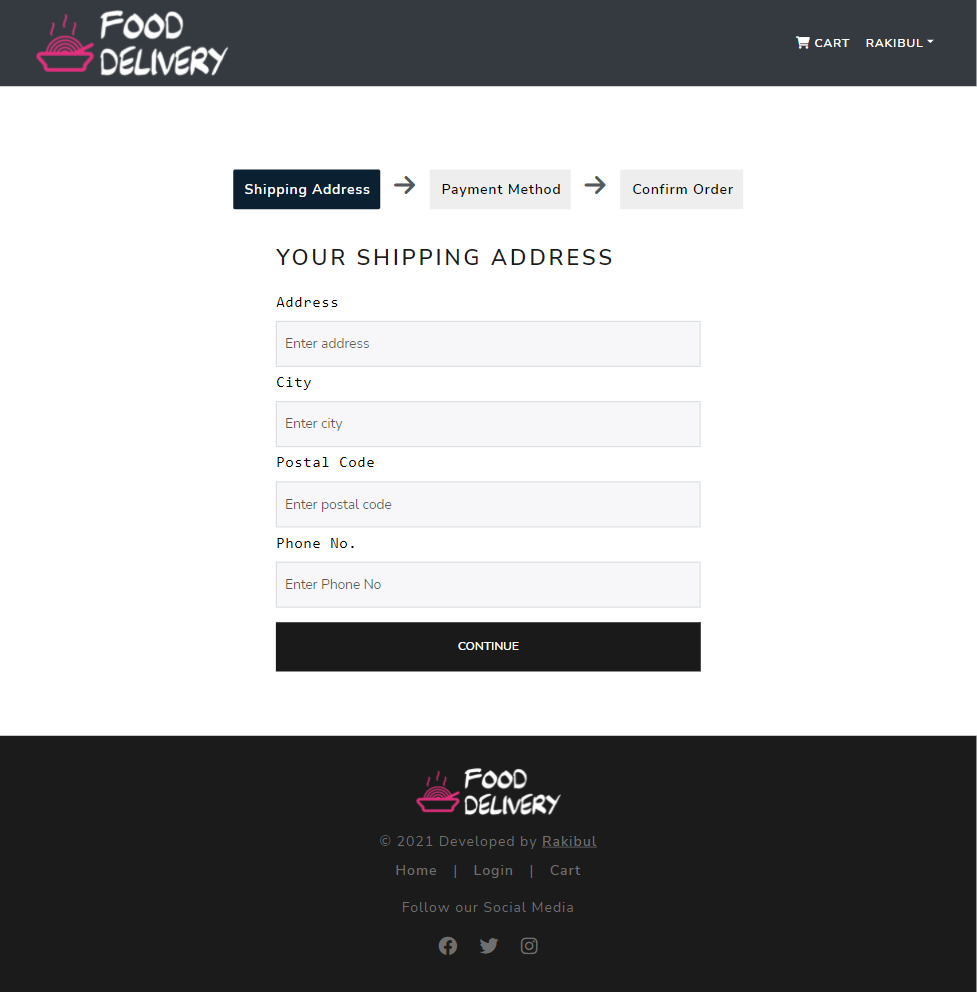

# Food Delivery WebApp 
---

## Overview

This is a food delivery web application that offers various items of food from a restaurant. With this website, user/customer can easily choose food items they like and buy any food that is available in stock.

### The Features
- user can add food to their shopping cart
- can search food
- can view details of any food items
- can increase/decrease the quantity while adding to the cart
- user also can delete the item
- If a user wants to checkout they have to login first
- New user can register with their email
- They can also login by google easily
- checkout pages are secured by JWT authentication
- user should select payment method and enter shipping address before place order
- Finally user can make payment
- Oder history is available for every user as well

### Screenshot

### Links

- Live Link : [Live Link](https://food-delivery24.herokuapp.com/)

